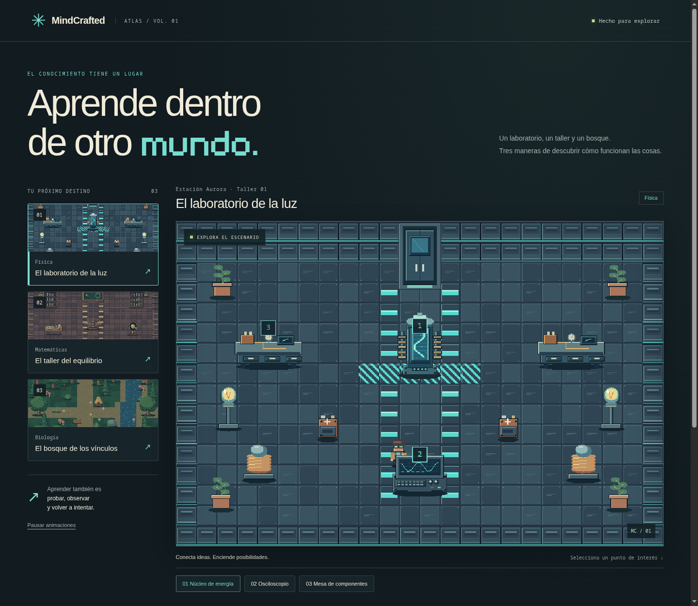

# MindCrafted · Atlas de mundos

Biblioteca original de pixel art creada con **Aseprite por terminal**, mapas nativos de **Tiled** y una vista web local con tres actividades educativas diferentes. No utiliza MCP ni llamadas a IA durante la construcción o reproducción.

## Ver el resultado

Desde la raíz de MindCrafted:

```bash
python3 pixel_worlds/scripts/serve.py
```

Abre **http://127.0.0.1:8011/web/**. El servidor comparte solamente esta carpeta y escucha en localhost. Si el puerto está ocupado, añade `--port 8012`. Para detenerlo, Ctrl+C. Abrir el HTML como `file://` no permite cargar los mapas mediante `fetch`.



## Los tres mundos

| Mundo | Arte y escenario | Actividad de referencia |
|---|---|---|
| El laboratorio de la luz | Metal azul verdoso, reactor, consola, baterías, bobinas y lámparas | Ajustar voltaje y resistencia para obtener 2 A en un circuito ideal |
| El taller del equilibrio | Madera, latón, biblioteca, balanza, pizarra y modelo orbital | Resolver `2x + 4 = 14` aplicando operaciones en ambos miembros |
| El bosque de los vínculos | Árboles, río, helechos, rocas, hongos, colmena y flores | Observar cómo dos factores limitantes afectan un índice ilustrativo |

Las actividades son **demostraciones de mecánicas**, con contenido fijo y modelos simplificados explicados en pantalla. El generador principal ya utiliza estos mundos para crear puzzles basados en apuntes; consulta [la guía de integración](../GUIA_GENERADOR_PUZZLES.mk). La demostración de esta carpeta conserva sus actividades fijas. La vista permite seleccionar puntos de interés; el personaje ambiental todavía no tiene controles de desplazamiento.

## Carpetas

| Ruta | Contenido |
|---|---|
| `art/source/` | 26 originales `.aseprite`, con capas y etiquetas de animación |
| `art/exports/` | PNG de primer fotograma y hojas horizontales de animación |
| `art/palettes/` | Paletas GPL de los recursos, importables en Aseprite |
| `art/catalog.json` | Identificadores, dimensiones, duración y rutas de los recursos |
| `scenes/` | Tres escenarios completos `.aseprite`, con cada objeto en una capa |
| `tilesets/` | Tres atlas de terreno y una colección de objetos `.tsj` |
| `maps/` | Mapas `.tmj` editables y copias `.tmx` exportadas con Tiled |
| `previews/` | Renderizados de Tiled y capturas de escritorio/móvil |
| `web/` | Atlas interactivo en HTML, CSS y JavaScript, sin dependencias npm |
| `scripts/` | Construcción, exportación y comprobaciones |
| `docs/ART_DIRECTION.md` | Reglas visuales y contrato para ampliar la biblioteca |
| `MindCrafted.tiled-project` | Proyecto que abre las carpetas en Tiled |
| `MindCrafted.world` | Vista conjunta de los tres mapas en Tiled |

## Editar en Aseprite

Abre un original de `art/source/`. Cada recurso separa **silueta y volumen**, **detalles y materiales**, y **luz y animación**. Los recursos animados incluyen fotogramas de 160 ms; `explorer` tiene etiquetas `idle` y `walk`. Las hojas exportadas son horizontales, sin recorte ni espacios entre fotogramas.

También puedes abrir un escenario de `scenes/` para ajustar su composición. Esas escenas son **copias editables independientes**: sus cambios no se sincronizan automáticamente con el mapa de Tiled. Para mantener la vista web sincronizada, edita las piezas en `art/source/` y la composición en Tiled.

Para exportar cambios de los recursos sin regenerar sus dibujos, desde la raíz del proyecto:

```bash
ASEPRITE_BIN="$HOME/aseprite/build/bin/aseprite"
PIXEL_ROOT="$PWD/pixel_worlds"
"$ASEPRITE_BIN" --batch --script-param "root=$PIXEL_ROOT" --script pixel_worlds/scripts/export_assets.lua
python3 pixel_worlds/scripts/export_maps.py
"$ASEPRITE_BIN" --batch --script-param "root=$PIXEL_ROOT" --script pixel_worlds/scripts/compose_scenes.lua
```

Ajusta `ASEPRITE_BIN` si lo instalas en otra ubicación. El exportador admite cambios de dibujo y duración uniforme; detecta cambios de tamaño o cantidad de fotogramas que requerirían actualizar el catálogo y el tileset. Exportar actualiza PNG, miniaturas y copias completas; **no ejecuta de nuevo el dibujo procedural**.

## Editar en Tiled

Abre `MindCrafted.tiled-project`, luego el mapa deseado de `maps/`. Usa `.tmj` como fuente principal. Las capas son:

- **Suelo:** piezas de 32 × 32 px.
- **Escenario:** objetos gráficos ordenados por su coordenada vertical.
- **Interacciones:** áreas con nombre, acción, texto e identificador de recurso.
- **Colisiones:** huellas de objetos y agua, preparadas para un motor con movimiento.
- **Inicio:** punto inicial para un futuro jugador controlable.

Las últimas tres están ocultas para exportar vistas limpias; actívalas para editar sus datos. La vista lee `Interacciones`, pero todavía no utiliza `Colisiones` para mover al personaje. Tras editar un mapa, ejecuta:

```bash
python3 pixel_worlds/scripts/export_maps.py
```

Este comando usa `tiled --export-map` y `tmxrasterizer --no-smoothing`. Los archivos existentes de `maps/*.tmx` y `previews/{mundo}.png` se actualizan. En Linux sin sesión gráfica puede hacer falta ejecutar mediante `xvfb-run`.

## Reconstruir en otra carpeta

Para obtener una copia nueva sin sustituir los originales editados:

```bash
python3 pixel_worlds/scripts/build.py --output /tmp/mindcrafted-art-review
python3 pixel_worlds/scripts/export_maps.py --root /tmp/mindcrafted-art-review
```

Esto reconstruye **arte, catálogo y mapas**; no copia la aplicación web ni compone las escenas Aseprite completas. Para regenerar los originales de esta carpeta se exige `--replace-art`, porque sustituye las modificaciones manuales. `build.py` detecta Aseprite en PATH, en `ASEPRITE_BIN` o en `~/aseprite/build/bin/aseprite`.

## Comprobaciones

```bash
python3 pixel_worlds/scripts/check_assets.py
node pixel_worlds/scripts/check_models.mjs
```

La primera valida fuentes Aseprite, dimensiones PNG, hojas de animación, rutas Tiled, IDs y accesibilidad de los puntos interactivos sobre una rejilla. La segunda comprueba circuito abierto/cerrado, conservación de soluciones de la ecuación y factores limitantes.

Para repetir la prueba real de navegador, inicia `serve.py` y un Chromium de pruebas con depuración remota en `127.0.0.1:9228`; después ejecuta `node pixel_worlds/scripts/check_browser.mjs`. Requiere Node 22 o superior, con `fetch` y `WebSocket` nativos. Puedes cambiar los destinos con `PIXEL_PREVIEW_URL` y `PIXEL_CDP_URL`. La prueba escribe capturas en `previews/`.

## Integración futura

`manifest.json` es el punto de entrada. Cada mundo declara materia, objetivo, mecánica, mapa y vista previa. Cada recurso declara imagen, fuente y animación. La integración está en `mindcrafted/generator/practice.py` y `mindcrafted/engine/practice/`: selecciona un mundo según el contenido, incorpora su mapa y arte al paquete y conecta de tres a cinco puzzles fundamentados en los apuntes. Los paquetes anteriores conservan su copia del arte; exporta y genera uno nuevo para aplicar cambios.

## Procedencia

Arte original dibujado por los scripts Lua de esta carpeta, bajo la licencia del repositorio: AGPL-3.0-or-later. No incluye sprites descargados de terceros. La fuente Pixelify Sans se copia desde los recursos existentes del proyecto y conserva su licencia OFL en `web/fonts/`.

Construcción comprobada con Aseprite `1.3.18.3-17-ge784f4dac-dev` y Tiled `1.12.2`.
